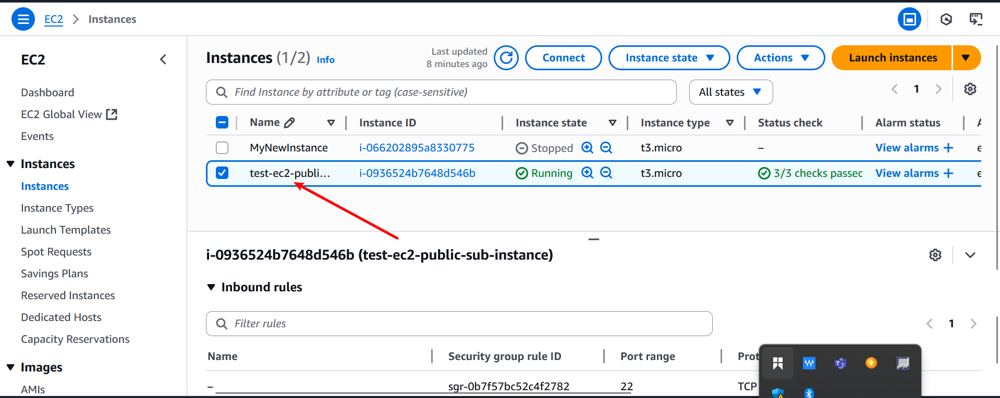
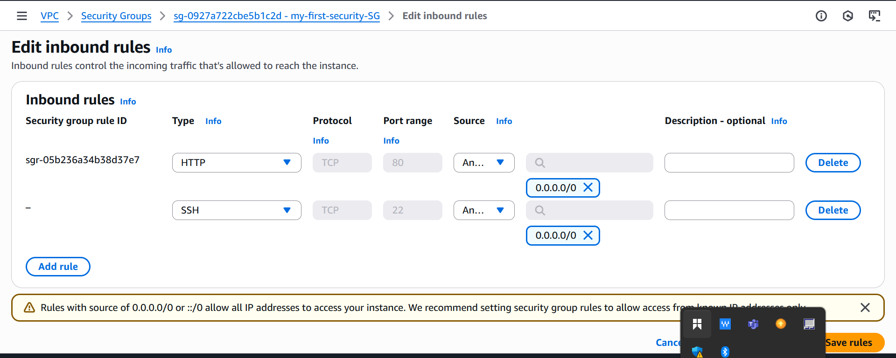

# Security_Group_And_NCL  

# Security Group

## Inbound Rules:
These control what traffic is allowed into your resource.

##  Outbound Rules:
These control what traffic is allowed to leave your resource.

## Stateful:
Stateful means that if an inbound rule allows traffic in, the response traffic is automatically allowed out, even if there's no specific outbound rule (and vice versa).

## Port:
A port is a communication endpoint that process the incoming and outgoing network traffic.

## Protocol:
A protocol defines how data is communicated.

# Network Access Control

##  subnet-level firewall
It controls incoming and outgoing traffic to and from subnets, unlike security groups which are attached to individual instances.

## Stateless
-Stateless means return traffic must be explicitly allowed.

-If you allow inbound on a port, you must also allow outbound for the response.

##  Allow / Deny Rules
Unlike security groups (which only allow traffic), NACLs can explicitly allow or deny traffic.

## Ingress (Inbound)
Controls traffic entering the subnet from outside (e.g., from the internet or other subnets).

##  Egress (Outbound)
Controls traffic leaving the subnet.

## CIDR Block (Classless Inter-Domain Routing)
- A CIDR block defines a range of IP addresses.

- Used to specify the source (for ingress) or destination (for egress).

## What is a Security Group?
A Security Group (SG) is a virtual firewall that controls network traffic to and from resources (like EC2 instances in AWS). It defines what kind of traffic is allowed in (inbound) and out (outbound).

## What is a Network Access Control List (NACL)?
A Network Access Control List (NACL) is a stateless, subnet-level firewall in a Virtual Private Cloud (VPC) that controls traffic in and out of a subnet.

# Default Setting 

## Default Security Group
When you create a VPC, AWS automatically creates a default security group for it. This is applied at the EC2 instance level (not subnet level).

## Default NACL (Network Access Control List)
Also automatically created with a new VPC, the default NACL is applied at the subnet level, acting as a basic firewall.

# PRATICAL PART

## PART1.

# Part - 1

Just a quick reminder about the subnets we configured in our VPC in the [Previous project](../AWS VPC mini project.md) . In the public subnet, we've created an EC2 instance that is running, hosting our website. Now, let's take a moment to see if we can access the website using its public IP address.

So this EC2 instance hosts our website.

Here is the security group configuration for the instance . in the inbound rules , only IPV4 SSH Trafficon port 22 is permitted to access this instance .

.

For the outbound rule , you will notice that all IPV4 traffic with any protocol with any port number is allowed , maning this instance has unrestricted access to anywhere on the internet.

.

Now let's test accessibiity to the website using Public IP address assigned to the instance .

Let's retrieve the public address.

if ypou enter http://51.20.254.206 into your browser , you notice that the page does not load or is not accessible .

This is because of the security group, we have not defined HTTP protocol in the security group so whenever the outside world is trying to go inside our instance and trying to get data , security group is restricting it and thats why we are unable to see data.

To resolve this we can create a new security group  that allow http (port 80) traffic.

1. Navigate to the security group section on the left sidebar.
a. click on create security group.
.

2. provide name and description for the new security group.

a. ensure you select your vpc during the creation process.
.

b. click add rule 

c. select HTTP as the type.
.

d. keep oubound rule as it is .
.

e. click on create security group.

Now , its being created successfully.
.

Lets attach this security group to our instance.

3. Navigate to the instance section of left side bar. select the instance ,click on action and choose security.
.

a. click on change security.
.

4. choose the security group you created and click add security group. yoy can see security group is being added and click on save .
.

Now it is being attach successfully
.

a.And when write http://13.51.8.218 in your browser you be able to see data of our website.

Let's take a look at how our inbound and outbound rules are configured.

This setup allow the HTTP and SSH to access the instance .

The outbound rule permits all traffic to exit the instance.
.

Through this rule we are able to see or access the website .
.

5. Lets see how removing the outbound rue affect the instance connectivity. Means that , now no one can go outside the instance .

a. Go to outbound tab. click and edit it.
.

b. click on delete and click save .

After that lets test weather we can still access the website.
.

so, even though we have removed outbound rule that allows all traffic from the instance to the ouside world , we ca still access the website . According to the logic we discussed , when a user access the instance , the inbound rule permit the HTTP protocol traffic to enter . However, when the instance send data to the user browser to display the website , the outbound rule should prevent it, yet we are able to see it . why ?
Security groups are stateful, which means they automatically allow return traffic initiated by the instances to which they are attached. So, even though we removed the outbound rule, the security group allows the return traffic necessary for displaying the website, hence we can still access it.
Let's explore the scenario:
If we delete both the inbound and outbound rules, essentially, we're closing all access to and from the instance. This means no traffic can come into the instance, and the instance cannot send any traffic out. So, if we attempt to access the website from a browser or any other client, it  will fail because there are no rules permitting traffic to reach the instance. Similarly, the instance won't be able to communicate with any external services or websites because all outbound traffic is also blocked.
You will be able to delete the inbound rule in the same way we have deleted the outbound rule.
a.Go to outbound tab.
b. Click on edit inbound rule.
.

c. click on delete and save rule.
.

Now, as both the inbound and outbound rules are deleted, there's no way for traffic to enter or leave the instance. This means that any attempt to access the website from a browser or any other client will fail because there are no rules permitting traffic to reach the instance. In this state, the instance is essentially isolated from both incoming and outgoing traffic.

So you can't access the website now.
.

In the Next scenerio , we will add a rule spacifically allowing HTTP traffic in the outbound rule . This change will enable the instance to initiate outgoing connections over HTTP.

8 click on edit outbound tab.

a. click on add rule,choose type,choose destination,choose CIDR and click on save.
.

.

.

Now, lets see if we can access the website.
.

you see we are not able to access it.
But we are able to go to the outside world from the instance . we are using here .
.

# PART 2.
Lets come to NACL,
1. First navaigate to the search bar and search for vpc and then click on it .
.

2. navigate to the Network Acl
.

3. provide a name for the network acl,choose the vpc you created previously and then click on create .
.

4. Select the network Acl you created, navigate to the inbound tab,.By default you will notice that its denying all traffic from all port.
.

Similarly , if you look at outbound rule, ypou will see the same thing.
.

5. To make changes ; select the NACL, go to the inbound tab and click inbound edit.
.

6. Click on add new rule , choose the rule number 
, specify the type and select the source.Determine weather to allow or deny traffic, and then click on save. 
.

Currently , the NACL is not association with subnet in the vpc.
.

7. Lets associate it ; select NACL,clcik on action, and choose Edit subnet association.
.

a. then select your public subnet, as our instance reside in there.
.

.

As soon as you have attached this NACL t your public subnet, and then you tery to access the website , you find that you will no be able to access it again.

Although we’ve permitted all traffic in the inbound rule of our NACL, we’re still unable to access the website. This raises the question: why isn’t the website visible despite these permissions?

The reason why we’re unable to access the website despite permitting inbound traffic in the NACL is because NACLs are stateless. They don’t automatically allow return traffic. As a result, we must explicitly configure rules for both inbound and outbound traffic.

Even though the inbound rule allows all traffic into the subnet, the outbound rules are still denying all traffic.

you can see, 
.

8. But if we allow outbound traffic as well; choose NACL, Go to outbound taband click edit outbound tab

a. click on add rule, duplicate the process you followed for creating the inbound rules to establish the outbound rule in a similar manner.
.

you have successfully created the rules.

Upon revisiting the website , you should now be able to access it.
.

Now lets see one more interesting scenario,

In this scenario :
security group : Allows inbound traffic for HTTP and SSH Protocols and permit all outbound traffic.

Network ACL: Denies all inbound traffic . lets observe the outcome of this configuration.

## Security Group :
Configuring it,
.

.

## NACL,
Lets remove it so by default it denied all traffic.
.

.

Additionally, the outbound rule will be removed , defaulting to deny all trafic by default.
.

.

Now , when you try to access the website, you find it is not accessible .

Now, Let’s have a look on some scenarios and their outcomes:

NACL allows all inbound and outbound traffic, Security Group denies all inbound and outbound traffic:

Outcome: Website access will be blocked because the Security Group denies all traffic, overriding the NACL's allowance.

NACL denies all inbound and outbound traffic, Security Group allows all inbound and outbound traffic:

Outcome: Website access will be blocked because the NACL denies all traffic, regardless of the Security Group's allowances.

NACL allows HTTP inbound traffic, outbound traffic is denied, Security Group allows inbound traffic and denies outbound traffic:

Outcome: Website access will be allowed because the Security Group allows HTTP inbound traffic, regardless of the NACL's allowances. However, if the website requires outbound traffic to function properly, it won't work due to the Security Group's denial of outbound traffic.

NACL allows all inbound and outbound traffic, Security Group allows HTTP inbound traffic and denies outbound traffic:

Outcome: Website access will be allowed because the Security Group allows HTTP inbound traffic, regardless of the NACL's allowances. However, if the website requires outbound traffic to function properly, it won't work due to the Security Group's denial of outbound traffic.

NACL allows all inbound and outbound traffic, Security Group allows all inbound and outbound traffic: Outcome: Website access will be allowed, as both NACL and Security Group allow all traffic.

NACL denies all inbound and outbound traffic, Security Group allows HTTP inbound traffic and denies outbound traffic:
Outcome: Website access will be blocked because the NACL denies all traffic, regardless of the Security Group's allowances.

